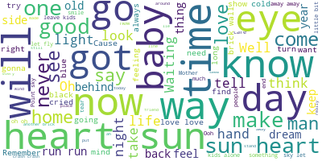
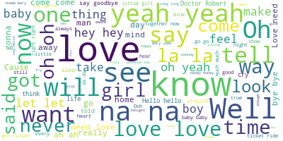
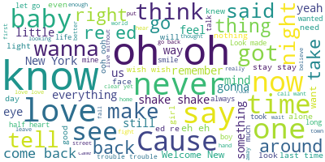

## 1) First collection of lyrics of The-Beatles, Pink-Flyod, Justin-Bieber and Taylor-Swift via Web-scrapping

## 2) Use of different Machine learning algorithms to predict the name of Artist based on their Lyrics

## 3) Also, there are some wordclouds based on the artist's lyrics

## 4) Finally, the best model is saved and used in a command-line interface argument to predict the artist with user given lyrics

## Worldcloud of Pink-Floyd

# Worldcloud of Beatles

# Worlcloud of Justin Bieber

# Worldcloud of Taylor-Swift

